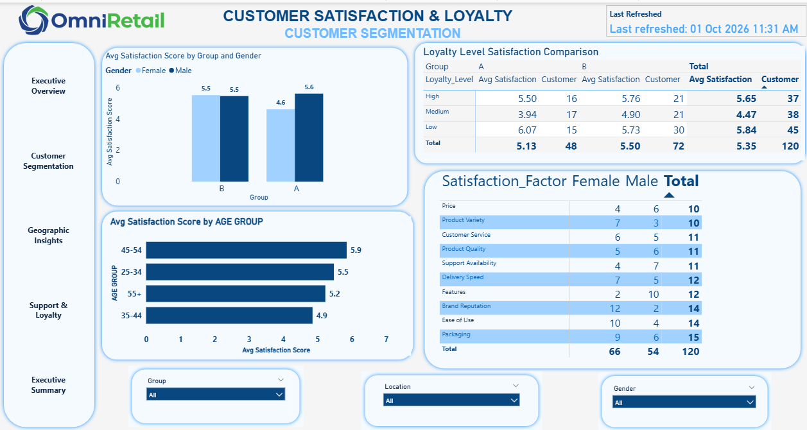
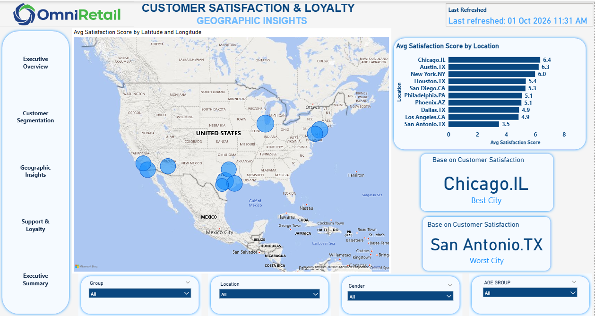
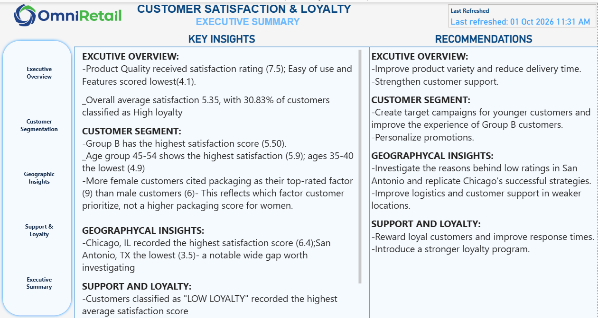

# 🛍️ OmniRetail Customer Analytics | Power BI

## 📊 Project Overview

The **OmniRetail Customer Analytics** project is an interactive Power BI business intelligence solution designed to analyze customer demographics, purchasing behavior, customer loyalty, satisfaction, support interactions, and geographic distribution.

The project transforms customer-level data into interactive analytical views that enable stakeholders to understand **who their customers are, how they behave, how loyal they are, how satisfied they are, and where they are located**.

The report was developed using **Microsoft Power BI**, with data preparation, data modeling, calculated measures, KPI development, interactive visualizations, segmentation, and geographic analysis.

---

# 🎯 Business Objectives

The analysis was designed to answer key business questions such as:

* How many customers are represented in the dataset?
* What is the distribution of customers across demographic groups?
* Which customer groups demonstrate higher loyalty?
* What is the overall customer satisfaction level?
* How many customers have contacted support?
* What percentage of customers contacted support?
* How does customer satisfaction vary across different segments?
* How is loyalty distributed across customer groups?
* Where are customers geographically concentrated?
* Which locations have the highest and lowest customer representation?
* What relationship exists between purchase history, support interaction, satisfaction, and loyalty?

---

# 🗂️ Dataset

The project uses a customer-level dataset containing information about customer demographics, location, purchasing behavior, loyalty, satisfaction, and support interactions.

The main analytical fields used in the Power BI report include:

| Column                | What It Represents                             | Analytical Purpose                                             |
| --------------------- | ---------------------------------------------- | -------------------------------------------------------------- |
| `CUSTOMER_ID`         | Unique identifier for each customer            | Identifies individual customers and supports customer counting |
| `Group`               | Customer grouping/segment                      | Enables customer segmentation analysis                         |
| `Location`            | Customer location/city                         | Used for geographic and location-based analysis                |
| `Gender`              | Customer gender                                | Supports demographic analysis                                  |
| `AGE GROUP`           | Customer age classification                    | Enables age-based segmentation                                 |
| `Loyalty_Level`       | Customer loyalty classification                | Measures and compares customer loyalty                         |
| `Support_Contacted`   | Indicates whether a customer contacted support | Used to analyze customer support interaction                   |
| `Purchase_History`    | Customer purchasing history/category           | Used to understand purchasing behavior                         |
| `Satisfaction_Factor` | Satisfaction-related customer classification   | Supports satisfaction segmentation                             |
| `Latitude`            | Geographic latitude                            | Used for geographic visualization                              |
| `Longitude`           | Geographic longitude                           | Used for geographic visualization                              |

---

# 🧹 Data Cleaning & Preparation

Before analysis, the customer data was prepared to ensure that the fields could be used consistently within Power BI.

### Common Cleaning & Preparation Processes

#### 1. Data Type Validation

Fields were reviewed and assigned appropriate data types for analysis.

Examples include:

* Customer ID → Identifier
* Gender → Categorical
* Age Group → Categorical
* Loyalty Level → Categorical
* Location → Categorical
* Latitude/Longitude → Geographic
* Satisfaction-related fields → Categorical/Analytical

#### 2. Duplicate & Customer ID Review

The `CUSTOMER_ID` field was reviewed to support accurate customer counting and avoid incorrect aggregation.

#### 3. Categorical Data Standardization

Categorical fields such as:

* Gender
* Group
* Location
* Loyalty Level
* Support Contact
* Purchase History
* Satisfaction Factor

were prepared for consistent analysis and segmentation.

#### 4. Age Group Preparation

Customer ages were represented through the `AGE GROUP` field to make demographic analysis easier and more meaningful.

#### 5. Geographic Data Preparation

`Latitude` and `Longitude` fields were prepared for geographic visualization and location-based analysis.

#### 6. Analytical Measures

Power BI measures were developed to generate important business KPIs, including:

* Total Customers
* Customer Count
* Support Contact %
* High Loyalty %
* Average Satisfaction Score

---

# 🧮 Key KPIs

The report includes calculated measures designed to provide a high-level view of customer performance and behavior.

### Core KPIs

* **Total Customers**
* **Customer Count**
* **Support Contact %**
* **High Loyalty %**
* **Average Satisfaction Score**

These KPIs provide the foundation for the detailed customer, geographic, loyalty, and support analysis.

---

# 📑 Power BI Report Structure

The Power BI report contains **five analytical pages**, each designed for a specific business purpose.

---

## 1️⃣ Executive Overview

The **Executive Overview** provides a high-level view of the customer base and major customer KPIs.

### Focus Areas

* Total customers
* Customer satisfaction
* Customer loyalty
* Support interaction
* Customer demographics
* Overall customer distribution

This page is designed for stakeholders who need a quick understanding of overall customer performance.

📸 **Screenshot:**

 

---

## 2️⃣ Customer Segmentation

The **Customer Segmentation** page focuses on understanding the composition of the customer base.

### Analysis Areas

* Customer groups
* Gender distribution
* Age groups
* Loyalty levels
* Customer satisfaction
* Customer purchasing behavior

This page helps identify differences between customer segments and provides a more detailed understanding of customer characteristics.

📸 **Screenshot:**



---

## 3️⃣ Geographic Insights

The **Geographic Insights** page examines where customers are located.

### Analysis Areas

* Customer locations
* Best-performing/highest customer locations
* Lowest customer locations
* Geographic distribution
* Latitude
* Longitude

The geographic analysis helps identify customer concentration and location-based opportunities.

📸 **Screenshot:**



---

## 4️⃣ Support & Loyalty

The **Support & Loyalty** page examines the relationship between customer support interaction, satisfaction, purchasing behavior, and loyalty.

### Analysis Areas

* Support contacted
* Support contact percentage
* Loyalty levels
* Satisfaction
* Purchase history
* Customer groups

This page provides a deeper view of customer engagement and loyalty-related behavior.

📸 **Screenshot:**


---

## 5️⃣ Executive Summary

The **Executive Summary** brings the major findings from the report together into a concise management-level view.

It provides stakeholders with a quick way to understand the most important customer analytics findings without navigating through every detailed analysis page.

📸 **Screenshot:**



---

# 🔄 Project Workflow

```text
Customer Dataset
       ↓
Data Cleaning & Preparation
       ↓
Data Modeling in Power BI
       ↓
Calculated Measures / KPIs
       ↓
Customer Segmentation
       ↓
Geographic Analysis
       ↓
Support & Loyalty Analysis
       ↓
Interactive Power BI Report
       ↓
Business Insights
```

---

# 📊 Dashboard / Report

The Power BI report serves as the main **interactive dashboard and analytical interface**.

The five report pages are:

| Page                  | Purpose                                      |
| --------------------- | -------------------------------------------- |
| Executive Overview    | High-level customer KPIs and performance     |
| Customer Segmentation | Customer demographic and behavioral analysis |
| Geographic Insights   | Location and geographic distribution         |
| Support & Loyalty     | Support, satisfaction and loyalty analysis   |
| Executive Summary     | Consolidated management-level view           |

---

# 📂 Project Files

### Power BI Report

[Open / Download Power BI Report](./report/OmniRetail%20Report.pbix)


---

# 🛠️ Tools & Technologies

| Tool                   | Purpose                                           |
| ---------------------- | ------------------------------------------------- |
| **Microsoft Power BI** | Data modeling, analysis and dashboard development |
| **Power Query**        | Data preparation and transformation               |
| **DAX**                | KPI and calculated measure development            |
| **Power BI Visuals**   | Interactive data visualization                    |
| **GitHub**             | Project documentation and portfolio presentation  |

---

# 📈 Skills Demonstrated

This project demonstrates practical experience in:

* Data Cleaning
* Data Transformation
* Data Modeling
* Exploratory Data Analysis
* Customer Segmentation
* Customer Analytics
* Geographic Analysis
* KPI Development
* DAX Measures
* Power Query
* Data Visualization
* Interactive Dashboard Development
* Business Intelligence
* Customer Satisfaction Analysis
* Customer Loyalty Analysis
* Business Insight Generation
* Data-Driven Decision Making

---

# 💼 Business Value

The OmniRetail Customer Analytics solution demonstrates how customer data can be transformed into a business intelligence solution that helps organizations understand:

**Customers → Behavior → Satisfaction → Support → Loyalty → Location**

By combining these dimensions in one interactive report, stakeholders can explore customer patterns and identify areas requiring further investigation or business action.

---

# 📸 Project Preview

## Executive Overview

 

## Customer Segmentation


## Geographic Insights


## Support & Loyalty


## Executive Summary


---

# 🔗 Project Repository

**GitHub Repository:**
`Add your repository link here`

**Power BI Report:**
[Download Power BI Report](./report/OmniRetail%20Report.pbix)

---

# 👤 About This Project

This project was developed as part of my **Data Analytics and Business Intelligence portfolio** to demonstrate the ability to transform customer data into an interactive analytical solution.

The project follows a complete analytics workflow:

**Prepare → Model → Analyze → Visualize → Interpret**

It demonstrates how Power BI can be used to turn customer data into meaningful information that supports business understanding and data-driven decision-making.
